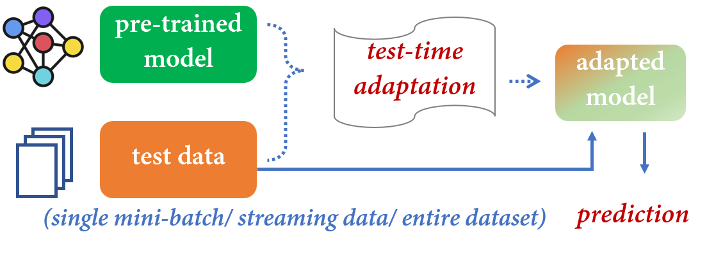

# I. Introduction
Test-time adaptation (TTA), an emerging paradigm, has the potential to adapt a pre-trained model to unlabeled data during testing, before making predictions.

In this survey, we divide TTA into several distinct categories, namely, 
+ test-time (source-free) **domain** adaptation (SFDA)
+ test-time **batch** adaptation (TTBA) 
+ **online** test-time adaptation (OTTA)
+ Test-time **Prior** Adaptation (TTPA)
+ Test-time **Instance** Adaptation (TTIA)

In short, TTA includes domain, batch, instance, online, and prior. 
## I.1 Common Attributes
+ The dataset (training and test) does not satisfy the **i.i.d** (independent, identical distribution) assumption.
+ The test dataset has been modified by **distribution shifts**. To be specific, adding Gaussian bias, different cameras, etc.
+ TTA has the advantage of being able to **access test data** from the target domain during the test phase. Further, TTA only requires access to the pre-trained model from the source domain, making it a secure and practical alternative solution.
## I.2 How to Categorize the TTA
Based on the **characteristics of the test data**, TTA methods can be categorized into three distinct cases: 
+ test-time (source-free) **domain** adaptation (SFDA), 
+ test-time **batch** adaptation(TTBA), 
+ **online** test-time adaptation (OTTA).

let us assume that we have $m$ unlabeled minibatches $\{b_1, \cdots , b_m\}$ at test time.
+ SFDA utilizes all $m$ test batches for multi-epoch adaptation before generating final predictions.
+ TTBA individually adapts the pre-trained model to one or a few instances.  That is to say, the predictions of each mini-batch are independent of the predictions for the other mini-batches.
+ OTTA adapts the pre-trained model to the target data $\{b1, \cdots, b_m\}$ in an online manner, where each mini-batch can only be observed once.

It is worth noting that OTTA methods can be applied to SFDA with multiple epochs, and TTBA methods can be applied to OTTA with the assumption of knowledge reuse.

Those three types of TTA methods focus on addressing **data shift** (e.g., covariate shift), while TTPA investigates the **label shift** scenario.
# II. Algorithm

The TTA algorithm uses uniform steps in all different types. The only difference is that the algorithm includes the self-supervisor processing.
## II.1 Algorithm 1
1. The algorithm uses the training dataset to train the model until reaches a high training accuracy. After the model finishes the training, we say that the model is the pre-trained model.
2. The algorithm uses the unlabeled testing dataset (a part or full) to train the pre-trained model. Since the testing dataset does not include any label, then the loss function will be different, such as entropy instead of the mean square error or cross-entropy. This step is the adaptation step.
## II.2 Algorithm 2
1. The algorithm uses the training dataset to train the model until reaches a high training accuracy. After the model finishes the training, we say that the model is the pre-trained model.
2. The testing data (a part or full) will be labelled by pseudo-label technical (clustering, etc).
3. The algorithm uses the labelled testing data to train the model. This step is the adaptation step.
# III. Problem Definition
## III.1 SFDA Problem Definition
### Definition 1 (Domain)
A domain $\mathcal{D}$ is a joint distribution $p(x, y)$ defined on the input-output space $\mathcal{X} \times \mathcal{Y}$, where random variables $x \in \mathcal{X}$ and $y \in \mathcal{Y}$ denote the input data and the label (output), respectively.

where
+  the domain of interest is called the target domain $p_{\mathcal{T}}(x,y)$
+  labeled data is called the source domain $p_{\mathcal{S}} (x, y)$
+  The label $y$ can either be discrete (in a classification task) or continuous (in a regression task)
+  $\mathcal{Y}$ is a $C$-cardinality label 
+  $D_{\mathcal{S}}=\{(x_1,y_1), \cdots, (x_{n_s}, y_{n_s})\}$ is labeled source domain
+  $D_{\mathcal{T}}=\{x_1, \cdots, x_n\}$ is unlabeled target domain

Distribution shift assumption:
+ $\mathcal{X_S = X_T}, p_{\mathcal{S}}(x) \ne p_{\mathcal{T}}(x)$
+ the *covariate shift* assumption $(p_{\mathcal{S}}(y|x)=p_{\mathcal{T}}(y|x))$

Typically, the unsupervised domain adaptation (UDA) paradigm aims to leverage supervised knowledge in $\mathcal{D_S}$ to help infer the label of each target sample in $\mathcal{D_T}$.

### Definition 2 (Source-free Domain Adaptation, SFDA)
Given a well-trained classifier $\mathcal{f_S: X_S \rightarrow Y_S}$ on the source domain $\mathcal{D_S}$ and an unlabeled target domain $\mathcal{D_T}$, *source-free domain* adaptation aims to leverage the labeled knowledge implied in $\mathcal{f_S}$ to infer labels of all the samples in $\mathcal{D_T}$, in a transductive learning manner. 

`Note` that, all test data (target data) are required to be seen during adaptation.
## III.2 TTBA Problem Definition
### Definition 3 (Test-Time Instance Adaptation, TTIA)
Given a classifier $\mathcal{f_S}$ learned on the source domain $\mathcal{D_S}$, and an unlabeled target instance $x_t \in \mathcal{D_T}$ under distribution shift, **test-time instance adaptation** aims to leverage the labelled knowledge implied in $\mathcal{f_S}$ to infer the label of $x_t$ adaptively.
### Definition 4 (Test-Time Batch Adaptation, TTBA)
Given a classifier $\mathcal{f_S}$ learned on the source domain $\mathcal{D_S}$, and a mini-batch of unlabeled target instances $\{x_t^1, \cdots, x_t^B\}$ from $\mathcal{D_T}$ under distribution shift ($B \ge 1$), **test-time batch adaptation** aims to leverage the labelled knowledge implied in $\mathcal{f_S}$ to infer the label of each instance at the same time.

It is important to acknowledge that the inference of each instance is not independent, but rather influenced by the other instances in the mini-batch.
+ Test-Time Batch Adaptation (TTBA) can be considered a form of SFDA when the batch size $B$ is sufficiently large.
+ When the batch size $B$ is equal to 1, TTBA degrades to TTIA.
  
Typically, these schemes assume no access to the source data or the ground-truth labels of data on the target distribution. In the following, we provide a taxonomy of TTBA (including TTIA) algorithms, as well as the learning scenarios.
## III.3 OTTA Problem Definition
### Definition 5 (Online Test-Time Adaptation, OTTA)
Given a well-trained classifier $\mathcal{f_S}$ on the source domain $\mathcal{D_S}$ and a sequence of unlabeled mini-batches $\{\mathcal{B_1, B_2, \cdots}\}$, online test-time adaptation aims to leverage the labelled knowledge implied in $\mathcal{f_S}$ to infer labels of samples in $\mathcal{B}_i$ under distribution shift, in an online manner.

In other words, the knowledge learned in previously seen mini-batches could be accumulated for adaptation to the current mini-batch.

+ The above definition corresponds to the problem addressed in Tent, where multiple mini-batches are sampled from a new data distribution that is distinct from the source data distribution.
+ Besides, it also encompasses the **online test-time instance adaptation** problem, as introduced in TTT-Online when the batch size equals 1.

However, samples at test time may come from a variety of different distributions, leading to new challenges such as error accumulation and catastrophic forgetting. To address this issue, CoTTA and EATA investigate the continual test-time adaptation problem that adapts the pre-trained source model to the continually changing test data. Such a nonstationary adaptation problem could be also viewed as a special case of the definition above, when each mini-batch may come from a different distribution.
## III.4 TTPA Problem Definition
### Definition 6 (Test-time Prior Adaptation, TTPA)
Given a classifier $\mathcal{f_S}$ learned on the source domain $\mathcal{D_S}$ and an unlabeled target domain $\mathcal{D_T}$, *test-time prior adaption* aims to correct the probabilistic predictions $\mathcal{p_S(y|x)=f_S(x)}$ for samples in $\mathcal{D_T}$ under the prior shift assumption.

Formally, prior shift (*a.k.a*.label shift), denotes that the marginal label distributions differ but the conditional distributions of input given label remain the same across domains, namely, $\mathcal{p_S(y) \ne p_T(y), p_S(x|y)=p_T(x|y)}$.

Based on the Bayes theorem and the label shift assumption, we have the following equations,

$$
\begin{align}
   \begin{aligned}
      \mathcal{p_T(y|x)} & = \mathcal{\frac{p_T(x|y)p_T(y)}{p_T(x)} = p_S(x|y)\cdot\frac{p_T(y)}{p_T(x)}} \\
      & \mathcal{= \frac{p_S(y|x)p_S(x)}{p_S(y)}\cdot \frac{p_T(y)}{p_T(x)} \propto p_S(y|x)\cdot\frac{p_T(y)}{p_S(y)}}
   \end{aligned}
\end{align}
$$

where $\mathcal{p_T(y|x)}$ denotes the corrected posterior probability from the biased prediction $\mathcal{p_S(y|x) \in \mathbb{R}^C}$ for each sample $x$ in the target set $\mathcal{D_T}$.

Therefore, the key to the prior-shift adaptation problem lies in how to obtain the test-time prior $\mathcal{p_T(y)}$ or the prior ratio $\mathcal{w(y) = \frac{p_T(y)}{p_S(y)}}$.  Moreover, the prior ratio could be also considered as the importance weight ($\mathcal{p_T(x,y)/p_S(x,y)}$), which further facilitates retraining the source classifier with a weighted empirical risk minimization. Note that, we only review different strategies of estimating the prior or prior ratio without the source training data, regardless of the follow-up correction strategy

`Note`. TTPA also has an online model in which their historical samples cannot be stored.
# IV. Pseudo-label
Pseudo-labeling aims to assign a class label $\hat{y} \in \mathbb{R}^C$ for each unlabeled sample $x$ in $\mathcal{X}_t$ and optimize the following supervised learning objective to guide the learning process,
$$
\begin{align}
   \min_{\theta}\mathbb{E}_{\{x,\hat{y}\} \in \mathcal{D}_t} w_{pl}(x)\cdot d_{pl}(\hat{y},p(y|x;\theta))
\end{align}
$$
where
+ $w_{pl}(x) \in \mathbb{R}$ denotes the weight associated with each pseudo-labeled sample $\{x,\hat{y}\}$
+ $d_{pl}(\hat{y},p(y|x;\theta))$ denotes the divergence between the predicted label probability distribution. e.g., $-\sum_c \hat{y}_c \log[p(y|x;\theta)]_c$ if using the cross entropy as the divergence measure.
+ $\hat{y}$ is Pseudo-label

Since the pseudo labels of target data are inevitably inaccurate under domain shift, there exist three different solutions:
1.  improving the quality of pseudo labels via denoising;
2.  filtering out inaccurate pseudo labels with $w_{pl}(\cdot)$; 
3.  developing a robust divergence measure $d_{pl}(\cdot,\cdot)$ for pseudo-labeling. 

The TTAs include so many pseudo-label methods, that this chapter only lists a `few of them`.

## IV.1 Centroid-based pseudo labels
The key idea is to obtain target-specific class centroids based on the network predictions and the target features and then derive the unbiased pseudo labels via the nearest centroid classifier.
$$
\begin{align}
   \begin{cases}
      m_c = \frac{\sum_x[p_{\theta}(y_c|x)\cdot g(x)]}{\sum_x p_{\theta}(y_c|x)}, c=\{1,\cdots,C\}\\
      \hat{y} = \arg \min_c d(g(x), m_c), \forall x \in \mathcal{D}_x
   \end{cases}
\end{align}
$$
where
+ $p_{\theta}(y_c|x)=[p(y|x;\theta)]_c$ denotes the probability associated with the $c$-th class
+ $g(x)$ denotes the feature of input $x$
+ $m_c$ denotes the $c$-th class centroid
+ $d(\cdot,\cdot)$ denotes the cosine distance function

## IV.2 Neighbor-based pseudo labels
Inspired by neighborhood aggregation, one line of work maintains a memory bank storing both features and predictions of the target data $\{g(x_i),q_i\}_{i=1}^n$, allowing online refinement of pseudo labels.  Typically, the refined pseudo label is obtained through
$$
\begin{align}
   \hat{p}_i = \frac{1}{m} \sum_{j \in \mathcal{N}_i} q_j
\end{align}
$$
where
+ $\mathcal{N}_i$ denotes the indices of $m$ nearest neighbors of
$g(x_i)$ in the memory bank.

## IV.3 Complementary pseudo labels
randomly chooses a label from the set $\{1, \cdots, C\}\{\hat{y}_i\}$ as the complementary label $\bar{y}_i$ and thus optimizes the following loss function,
$$
\begin{align}
   \min_{\theta} - \sum_{i=1}^{\mathcal{N}_t} \sum_{c=1}^C 1_{\bar{y}_i=c} \log (1 - p_{\theta}(y_c|x_i))
\end{align}
$$
where 
+ $\hat{y}_i$ denotes the inferred hard pseudo label.
+ $\bar{y}$ as a negative pseudo label that indicates the given input does not belong to this label.

Note that, the probability of correctness is $\frac{C-1}{C}$ for the complementary label $\bar{y}_i$, providing correct information even from wrong labels $\hat{y}_i$.

## IV.4 Optimization-based pseudo labels
By leveraging the prior knowledge of the target label distribution like class balance, a line of SFDA methods varies the threshold for each class so that a certain proportion of points per class are selected.  Such a strategy would avoid the ‘winner-takes-all’ dilemma where pseudo labels come from several major categories and deteriorate the following training process.  

The pseudo labels $\hat{p}_i$ and solves the following optimization problem,
$$
\begin{align}
   \begin{aligned}
      \min_{\hat{p}_i} - \sum_i \sum_c \hat{p}_{ic} \log p_{\theta}(y_c|x_i)+\lambda \sum_i\sum_c \hat{p}_{ic} \log \hat{p}_{ic}\\
      \text{s.t. } \forall i,c: \hat{p}_{i,c} \in [0,1], \sum_c \hat{p}_{ic} = 1, \sum_i \hat{p}_{ic}=\frac{\mathcal{N}_t}{C}
   \end{aligned}
\end{align}
$$
# V. Training
## V.1 Training in the SFDA
### V.1.1 Consistency Training
consistency regularization is primarily built on the smoothness assumption or the manifold assumption, which aims to enforce consistent network predictions or features under variations in the input data space or the model parameter space.

Besides, another line of consistency training methods tries to match the statistics of different domains even without the source data.

#### Consistency under data variations
Benefiting from advanced data augmentation techniques, several prominent semi-supervised learning methods, unleash the power of consistency regularization over unlabeled data that can be effortlessly adopted in SFDA approaches.

Formally, an exemplar of consistency regularization is expressed as:
$$
\begin{align}
   \mathcal{L}_{fm}^{con} = \frac{1}{\mathcal{N}_t}\sum_{i=1}^{\mathcal{N_t}} CE(p_{\tilde{\theta}}(y|x_i), p_{\theta}(y_c|\hat{x}_i))
\end{align}
$$
where
+ $p_{\theta}(y|x_i) = p(y|x;\theta)$
+ $CE(\cdot,\cdot)$ refers to cross-entropy between two distribution
+ $\hat{x}_i$ represents the variant of $x_i$ under another augmentation transformation
+ $\tilde{\theta}$ is a fixed copy of current network parameter $\theta$

Another representative consistency regularization is virtual adversarial training (VAT)  that devises a smoothness constraint as follows,
$$
\begin{align}
   \mathcal{L}_{vat}^{con} = \frac{1}{\mathcal{N}_t}\sum_{i=1}^{\mathcal{N_t}} \max_{||\bigtriangleup_i||\le\epsilon} [KL(p_{\tilde{\theta}}(y|x_i)|| p_{\theta}(y|x_i + \bigtriangleup_i))]
\end{align}
$$
where 
+ $\bigtriangleup_i$  is a perturbation that disperses the prediction most within an intensity range of $\epsilon$ for the target data $x_i$
+  KL denotes the Kullback–Leibler divergence
  
#### Consistency under model variation
Reducing model uncertainty is also beneficial for learning robust features for SFDA tasks on top of uncertainty measured with input
change.

+ SFDA-UR and RuST append multiple extra dropout layers behind the feature encoder and minimize the mean squared error between predictions as uncertainty.
+ FMML offers another type of model variation by network slimming and sought predictive consistency across different networks.
+ the mean teacher framework is also utilized to form a strong teacher model and a learnable student model, where the teacher and the student share the same architecture, and the weights of the teacher model $θ_{tea}$ are gradually updated by,
$$
\begin{align}
   \theta_{tea} = (1 - \eta)\theta_{tea}+ \eta \theta
\end{align} 
$$
where 
1. $\theta$ denotes the weights of the student model,
2. $\eta$ is the momentum coefficient

#### Consistency under data & model variations
For example, the mean teacher framework is enhanced by blending strong data augmentation techniques, and the discrepancy between predictions of the student and teacher models is minimized as follows,
$$
\begin{align}
   \mathcal{L}_{mt}^{con} = \mathbb{E}_{x \in \mathcal{D}_t} d_{mt}(p(y|x,\theta), p(y|\tau(x), \theta_{tea}))
\end{align}
$$
where 
+ $\tau(\cdot)$ denotes the strong data augmentation
+ $d_{mt}$ denotes the divergence measure, such as MSE, the Kullback-Leibler, and cross-entropy loss.

### V.1.2 Clustering-based Training
Except for the pseudo-labeling paradigm, one assumption explicitly or implicitly made in virtually all semi-supervised learning algorithms is the cluster assumption, which states that <u>the decision boundary should not cross high-density regions, but instead lie in low-density regions</u>. Motivated by this, another popular family of SFDA approaches favors low-density separation by reducing the uncertainty of the target network predictions or encouraging clustering over the target features.

#### Entropy minimization
To encourage confident predictions for unlabeled target data, ASFA borrows robust measures from information theory and minimizes the following $\alpha$-Tsallis entropy,
$$
\begin{align}
   \mathcal{L}_{tsa} = \frac{1}{\mathcal{N}_t}\sum_{i=1}^{\mathcal{N}_t} \frac{1}{\alpha - 1} [1 - \sum_{c=1}^C p_{\theta}(y_c | x_i)^{\alpha}]
\end{align}
$$
where $\alpha \gt 0$ is called the entropic index.

+ when $\alpha$ approaches 1, the Tsallis entropy exactly recovers the standard Shannon entropy in $\mathcal{H}(p_{\theta}(y|x_i))=\sum_c p_{\theta}(y_c | x_i) \log p_{\theta}(y_c | x_i)$
+ When α equals 2, the Tsallis entropy corresponds to the maximum squares loss, $\sum_c p_{\theta}(y_c | x_i)^2$. Compared with the Shannon entropy, the gradient of the maximum squares loss increases linearly, preventing easy samples from dominating the training process in the high probability area.

#### Mutual information maximization
Another favorable clustering-based regularization is mutual information maximization, which tries to maximize the mutual information between inputs and the discrete labels as follows,
$$
\begin{align}
   \begin{aligned}
      \max_{\theta}\mathcal{I(X_t, \hat{Y}_t) = H(\hat{Y}_t) - H(\hat{Y_t}|X_t)} \\
      = - \sum_{c=1}^C \bar{p}_{\theta}(y_c) \log \bar{p}_{\theta}(y_c) + \frac{1}{\mathcal{N}_t} \sum_{i=1}^{\mathcal{N}_t} \sum_{i=1}^C p_{\theta}(y_c | x_i)\log p_{\theta}(y_c | x_i)
   \end{aligned}
\end{align} 
$$
where $\bar{p}_{\theta}(y_c) =\frac{1}{\mathcal{N}_t} \sum_i p_{\theta}(y_c |x_i)$ denotes the $c$-th element in the estimated class label distribution.

Intuitively, increasing the additional diversity term $\mathcal{H(\hat{Y}_t)}$ encourages the target labels to be uniformly distributed, circumventing the degenerate solution where every sample is assigned to the same class.

`Note` that the diversity term can be rewritten as 
$$\mathcal{H(\hat{Y}_t)} = -KL(\bar{p}_{\theta}(y)||\mathcal{U}) + \log C$$
where
+ $\bar{p}_{\theta}(y)$ is the average label distribution in the target domain
+ $\mathcal{U}$ denotes a $C$-dimensional uniform vector

This term alone has also been used in many SFDA methods to avoid class collapse.

#### Explicit clustering
Other clustering-based methods explicitly perform feature-level clustering to encourage more discriminative decision boundaries.  Inspired by neighborhood clustering, CPGA and StickerDA calculate the normalized instance-to-instance similarity with a memory bank $\{\bar{g}(x_i)\}_{i=1}^{\mathcal{N}_t}$ and thus minimize the following entropy,
$$
\begin{align}
   \mathcal{L}_{nc} = - \frac{1}{\mathcal{N}_t}\sum_{i=1}^{\mathcal{N_t}} \sum_{j \ne i} s_{ij} \log s_{ij}
\end{align}
$$
where 
+ $s_{ij} = \frac{exp(g(x_i)^{\top}\bar{g}(x_j)/\tau)}{\sum_{k\ne i} exp(g(x_i)^{\top}\bar{g}(x_k)/\tau)}$ represents the normalized similarity between the $i$-th target feature and the $j$-th feature stored in the memory bank
+ $\tau$ denotes the temperature parameter
## V.2 Training in the TTBA
The SFDA training algorithm can be reused here.
## V.3 Training in the OTTA
The SFDA training algorithm can be reused here.

### V.3.1 Entropy Minimization
Entropy minimization is a widely used technique to handle unlabeled data. A pioneering approach, Tent, proposes minimizing the mean entropy over the test batch to update the affine parameters $\{\gamma, \beta\}$ of BN layers in the pre-trained model, followed by various subsequent methods. 

There exist many alternatives to entropy minimization for adapting models to unlabeled test samples including class confusion minimization, batch nuclear-norm maximization, maximum squares loss, and mutual information maximization. 

SAR encourages the model to lie in a flat area of the entropy loss surface and optimizes the minimax entropy objective below,
$$
\begin{align}
   \min_{\theta} \max_{||\bigtriangleup_{\theta}||_2 \le \epsilon} \mathcal{H}(x;\theta + \bigtriangleup_{\theta})
\end{align} 
$$
where
+ $\mathcal{H}(\cdot)$ denotes the entropy function
+ $\bigtriangleup_{\theta}$ denotes the weight perturbation in a Euclidean ball with radius $\epsilon$
## V.4 Training in the TTPA
### V.4.1 Confusion Matrix
#### Prior estimation
a standard procedure used for estimating the test-time prior involves the computation of the confusion matrix, $[C_{\hat{y}|y}]_{i,j} = p(\hat{y} = i | y = j)$, denoting the probability of predicting class $i$ when
the observation in fact belongs to the $j$-th class.

Specifically, the confusion matrix-based method tries to solve the following system of $C$ linear equations with respect to $\mathcal{p_T(\hat{y})}$,
$$
\begin{align}
   \mathcal{p_T(\hat{y}=i)}=\sum_{j=1}^C [C_{\hat{y}|y}]_{i,j}\mathcal{p_T(y=j)}, i=1,\cdots, C
\end{align} 
$$
Intuitively, there exists a closed-form solution, $\mathcal{\hat{p}_T(y)=[C_{\hat{y}|y}]^{-1}p_T(\hat{y})}$, where $\mathcal{p_T(\hat{y})}$ denotes the estimated class label frequency over the original predictions $\mathcal{f_S(x)}$ on the unlabeled test data set.

Note that, the confusion matrix $C_{\hat{y}|y}$ could be obtained using a holdout training data set, which is proven to be unchanged under the label shift assumption. To avoid such infeasible solutions, a bootstrap method is developed to alternately calculate the confusion matrix $C_{\hat{y}|y}$ on holdout data and estimate the predicted class frequency $\mathcal{p_T(\hat{y})}$ on test data.

#### Prior ratio estimation
BBSE exploits the confusion matrix with <u>joint probability instead of the conditional one above</u>, and directly estimates the prior ratio $\mathcal{w(y) =p_T(y)/p_S(y)}$ based on the following equation,
$$
\begin{align}
   \mathcal{p_T(\hat{y}=i)} = \sum_{j=1}^C [C_{\hat{y},y}]_{i,j} w(y=j), i=1,\cdots, C
\end{align}
$$
$$
\begin{aligned}
   & \sum_{j=1}^C \mathcal{p(\hat{y}=i | y=j) \cdot p_T(y=j)} \\
   & = \sum_{j=1}^C \mathcal{\frac{p(\hat{y}=i,y=j)}{p_S(y=j)} \cdot p_T(y=j)}
\end{aligned}
$$
where 
+ the confusion matrix $[C_{\hat{y},y}]_{i,j}$ is computed with hard predictions over the holdout training data set
+  a soft variant is further explored in [20].

To diminish large variances in prior ratio estimation, RLLS proposes to incorporate an additional regularization term $||\theta||_2$,  forming
the constrained optimization problem as follows,
$$
\begin{align}
   \min_{\theta} ||C_{\hat{y},y}\cdot (\theta + 1) - \mathcal{p_T(\hat{y})}||_2 + \lambda ||\theta||_2
\end{align}
$$
where 
+ $\theta = w - 1$ is called the amount of weight shift
+ $\lambda$ is a regularization hyper-parameter

### V.4.2 Maximum Likelihood Estimation (MLE)
MLLS proposes a straightforward instance of the Expectation-Maximization (EM) algorithm to maximize the likelihood, providing a simple iterative procedure for estimating the prior $\mathcal{p_T(y)}$. In particular, MLLS alternately reestimates the posterior probabilities $\mathcal{\hat{p}_T(y|x)}$ for each test sample and the prior probability $\mathcal{\hat{p}_T(y)}$ as follows,
$$
\begin{align}
   \begin{aligned}
      \mathcal{\hat{p}_T(\hat{y}=i | x)} = \frac{\hat{w}(y=i)\cdot\mathcal{p_S(y=i|x)}}{\sum_{j=1}^C \hat{w}(y=j)\cdot\mathcal{p_S(y=j|x)}}, (E-step) \\
      \mathcal{\hat{p}_T(y=i)} = \frac{1}{n_t} \sum_{\mathcal{x \in X_t}} \mathcal{\hat{p}_T(y=i|x)}, (M-step) \\
      \hat{w}(y=i) = \mathcal{\frac{\hat{p}_T(y=i)}{p_S(y=i)}}, \forall i \in [1, C]
   \end{aligned}
\end{align}
$$
where
+ $\mathcal{p_S(y|x)}$ is modeled by the classifier’s output $\mathcal{f_S(x)}$
+ $\mathcal{\hat{p}_T(x)}$ is initialized by the estimation of class frequencies in the target domain

this iterative procedure will increase the likelihood of target data at each step. Besides, the EM algorithm could be also reformulated as minimizing the KL divergence between the target data distribution $\mathcal{p_T(x)}$ and its approximation by a linear combination of class-wise distributions $\mathcal{p_T'(x)}$,
$$
\begin{align}
   \mathcal{p_T'(x)} = \sum_c \lambda_c \mathcal{p_T(x|y = c)}, 
   \text{s.t. } \sum_c \lambda_c = 1
\end{align}
$$
where $\lambda_c$ can be considered as an exact approximation of $\mathcal{p_T(y=c)}$.

#### Calibration
+ the probability estimates are calibrated from naive Bayes in the maximization step (M-step).
+ BCTS offers a temperature scaling solution to achieve an explicit calibration for $\mathcal{p_T(y|x)}$ in the expectation step (E-step), which is inspired by a prominent method.  To be specific, BCTS scales the softmax logits $l(x)$ with a temperature parameter T and additionally
considers the class-specific bias terms $\{b_i\}_{i=1}^C$ as follows,
$$
\begin{align}
   \mathcal{p_T(y=i|x)} = \frac{exp([l(x)]_i/T) + b_i}{\sum_j exp([l(x)]_j/T) + b_j}
\end{align}
$$

### V.4.3 MLE with Confusion Matrix
MLLS-CM unifies the confusion matrix strategy and the EM-based MLE strategy under a common framework. In particular, the confusion matrix strategy is employed to obtain a calibrated predictor in the E-step. Besides, SCML provides another confusion-based MLE approach that inserts the confusion matrix-based prior into the log-likelihood maximization objective as follows,
$$
\begin{align}
   \begin{aligned}
      \max_{\mathcal{p_T(y)}} \sum_{i=1}^C m_i \log(C_{\hat{y}=i|y} \cdot \mathcal{p_T(y)}) \\
      \text{s.t. } \sum_i \mathcal{p_T(y=i) = 1}, \mathcal{p_T(y=i)} \ge 0, i \in [1, C] 
   \end{aligned}
\end{align}
$$
where 
+ $m_i$ is the number of samples predicated to the $i$-th class on the target set. 

The projected gradient ascent algorithm with a simplex constraint is iteratively employed to maximize such a convex objective above.

### V.4.4 Online TTPA Algorithms
Without requiring the whole dataset at test time, another line of TTPA methods focuses on the case of online adaptation at prediction time (*i.e*., sample after sample).  It is worth noting that offline TTPA algorithms could also address the online label shift scenario, for instance, estimating the priors from the already-seen examples. In the following, we mainly introduce online TTPA methods when historical samples could not be stored.

OEM provides an online (or evolving) prior estimation approach to adjust the posterior probability sample by sample. OEM is built on the seminal work in **Maximum Likelihood Estimation** that extends the prior estimation step as:
$$
\begin{align}
   \mathcal{\hat{p}_T(y=i) \leftarrow (1-\alpha)\hat{p}_T(y=i) + \alpha\hat{p}_T(y=i|x_t)}
\end{align}
$$
where
+ $x_t$ denotes the $t$-th test data from the sequence
+ $\alpha$ is the hyper-parameter to control the updating rate

Besides, $PTCA_U$ directly estimates a categorical distribution from a set of $L$ most recent target samples below,
$$
\begin{align}
   \mathcal{\hat{p}_T}(y=i|x_i) = \frac{\sum_{r=t-L+1}^t [\delta_r(y)]_i + \alpha}{L+C\cdot\alpha}
\end{align}
$$
where
+ $\delta_r(y) \in \mathbb{R}^C$ denotes the prediction of $x_r$
+ $\alpha \gt 0$ is the parameter of the Dirichlet prior

# VI. Special Operation
## VI.1 Batch Normalization Calibration
The TTA has a special procedure during batch normalization. Here will list the standard batch normalization algorithm then the subsection will discuss the modification by the TTA.

For example, a batch normalization (BN) layer calculates the mean and variance for each activation over the training data $\mathcal{X_S}$, and normalizes each incoming sample $x_s$ as follows,
$$
\begin{align}
   \hat{x}_s = \gamma \frac{x_s - \mathbb{E}[X_\mathcal{S}]}{\sqrt{\mathbb{V}[X_{\mathcal{S}}] + \epsilon}} + \beta
\end{align} 
$$
where 
+ $\gamma$ and $\beta$ denote the scale and shift parameters
+ $\epsilon$ is a small constant introduced for numerical stability

The BN statistics (i.e., the mean $\mathbb{E}[X_\mathcal{S}]$ and variance $\mathbb{V}[X_{\mathcal{S}}]$) are typically approximated using exponential moving averages over batch-level estimates $\{\mu_k, \sigma^2_k\}$,
$$
\begin{align}
   \hat{\mu}_{k+1} = (1 - \rho)\cdot \hat{\mu}_k + \rho \cdot \mu_k, \hat{\sigma}^2_{k+1} = (1 - \rho)\cdot \hat{\sigma}^2_k + \rho \cdot \sigma^2_k
\end{align}
$$
where 
+ $\rho$ is the momentum term
+ $k$ denotes the training step

the BN statistics over the $k$-th mini-batch $\{x_i\}^{B_s}_{i=1}$ are
$$ 
\begin{align}
   \mu_k = \frac{1}{B_s}\sum_i x_i, \sigma^2_k = \frac{1}{B_s} \sum_i (x_i - \mu_k)^2
\end{align}
$$
where $B_s$ denotes the batch size at training time. During inference, the BN statistics estimated at training time are frozen for each test sample.
### VI.1.1 Batch Normalization in TTBA
PredBN+ adopts the running averaging strategy for BN statistics during training and suggests mixing the BN statistics per batch with the training statistics $\{\mu_s, \sigma^2_s\}$ as,
$$
\begin{align}
   \bar{\mu}_t = (1 - \rho_t)\cdot \mu_t + \rho_t \cdot \mu_t, \bar{\sigma}^2_t = (1 - \rho_t)\cdot \sigma^2_s + \rho_t \cdot \sigma^2_t
\end{align}
$$
where 
+ $\rho_t$ controls the trade-off between training and estimated test statistics

Moreover, TTN presents an alternative solution that calibrates the
estimation of the variance as follows,
$$
\begin{align}
   \bar{\sigma}^2_t = (1 - \rho_t)\cdot\sigma^2_s + \rho\cdot\sigma^2_t + \rho_t(1-\rho)(\mu_t - \mu_s)^2
\end{align}
$$
Instead of using the same value for different BN layers, TTN optimizes the interpolating weight $\rho_t$ during the posttraining phase using labeled source data.

Typically, methods that rectify BN statistics may suffer from limitations when the batch size B is small, particularly when $B = 1$.
+ CBNA and SaN directly attempt to mix instance normalization (IN) statistics estimated per instance with the training BN statistics.
+ Instead of manually specifying a fixed value at test time, InstCal introduces an additional module during training to learn the interpolating weight between IN and BN statistics, allowing the network to dynamically adjust the importance of training statistics for each test instance. 
+ By contrast, AugBN expands a single instance to a batch of instances using random augmentation and then estimates the BN statistics using the weighted average over these augmented instances.
### VI.1.2 Batch Normalization in OTTA
In the following, we mainly focus on the BN layer due to its widespread usage in existing methods.

Tent and RNCR propose replacing the fixed BN statistics (i.e., mean and variance $\{\mu_s, \sigma_s^2\}$) in the pre-trained model with the estimated ones $\{\hat{\mu}_t, \hat{\sigma}_t^2\}$ from the $t$-th test batch.

Core calibrates the BN statistics by interpolating between the fixed source statistics and the estimated ones at test time, namely, $\mu_t = \rho \hat{\mu}_t + (1-\rho)\mu_s, \sigma_t = \rho  \hat{\sigma}_t + (1 - \rho)\sigma_s$, where $\rho \in [0,1]$ is a momentum hyper-parameter.

Similar to the running average estimation of BN statistics during training, ONDA and two follow-up methods propose initializing the BN statistics $\{\mu_0, \sigma_0\}$ as $\{\mu_s, \sigma_s\}$ and updating them for the $t$-th test batch,
$$
\begin{align}
   \begin{aligned}
      \mu_t = \rho\hat{\mu}_t + (1 - \rho)\mu_{t-1} \\
      \sigma^2_t = \rho\hat{\sigma}^2_t + (1 - \rho) \frac{n_t}{n_t - 1}\sigma_{t-1}^2
   \end{aligned}
\end{align}
$$
where 
+ $n_t$ denotes the number of samples in the batch, and the $\rho$ is a momentum hyperparameter. 
+ $\rho$ is a momentum hyperparameter. 

To decouple the gradient backpropagation and the selection of BN statistics, GpreBN and DELTA adopt the following reformulation of batch re-normalization,
$$
\begin{align}
   \hat{x}_t = \gamma \cdot \frac{\frac{x_t - \hat{\mu}_t}{\hat{\sigma}_t} \cdot sg(\hat{\sigma}_t)+sg(\hat{\mu}_t) - \mu}{\sigma} + \beta
\end{align}
$$
where 
+ $sg(\cdot)$ denotes the stop-gradient operation
+ $\{\gamma, \beta\}$ are the affine parameters in the BN layer

For online adaptation with a single sample, 
+ MixNorm mixes the estimated IN statistics with the exponential moving average BN statistics at test time.
+ DUA adopts a decay strategy for the weighting hyper-parameter $\rho$ and forms a small batch from a single image to stabilize the online adaptation process.
+ To obtain more accurate estimates of test-time statistics, NOTE maintains a class-balanced memory bank that is utilized to update the BN statistics using an exponential moving average.
+ NOTE proposes a selective mixing strategy that only calibrates the BN statistics for detected out-of-distribution samples.
+ TN-SIB also leverages a memory bank that provides samples with similar styles to the test sample, to estimate more accurate BN statistics.
